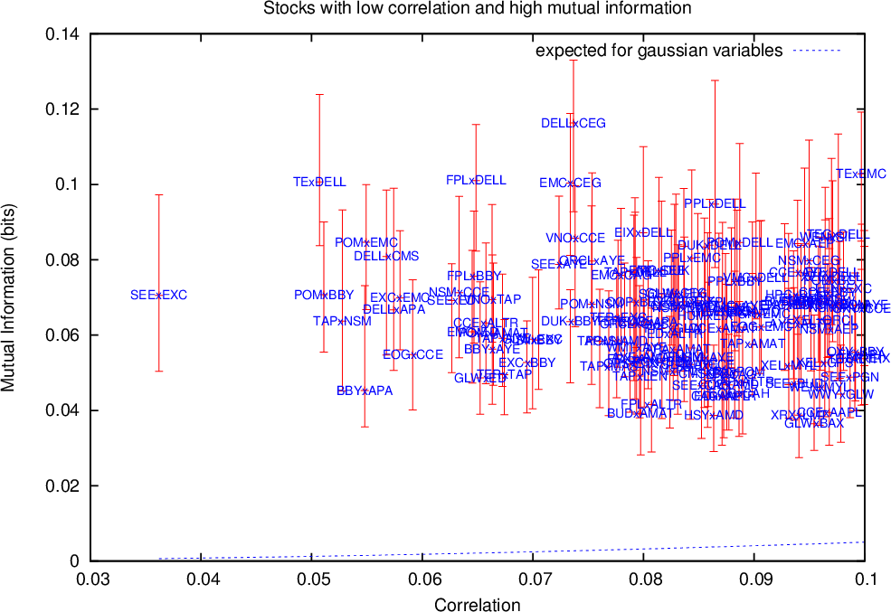
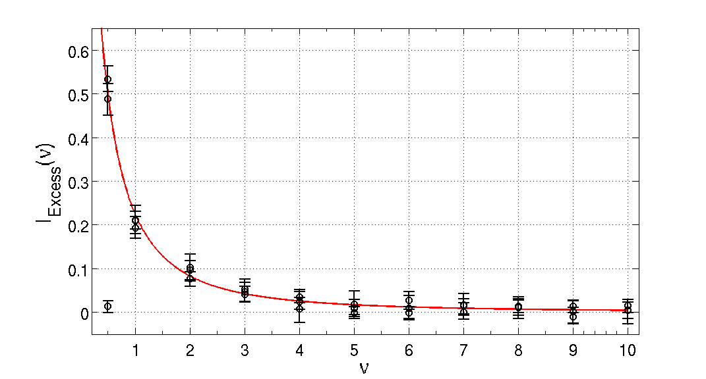
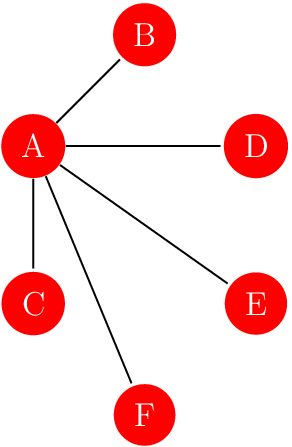

= data-scale="2"
# Tese: Uma abordagem mecânico-estatística de dois tópicos de interesse em finanças, economia e sociologia.

## Rafael S. Calsaverini

<ul>
<li>Tese - github repo: https://github.com/rcalsaverini/Thesis</li>
<li>pdf: https://github.com/rcalsaverini/Thesis/blob/master/TeseRafaelCalsaverini.pdf?raw=true</li>
</ul>

---

# Parte 1: Teoria de dependência estatística, Cópulas e teoria de informação

<ul>
<li> Artigo: R. S. Calsaverini and R. Vicente. An information-theoretic approach to statistical dependence: Copula information.<em> Europhys. Lett. </em>88 68003, 2009.</li>
<li> URL: http://iopscience.iop.org/0295-5075/88/6/68003?ejredirect=migration</li>
</ul>

---
= data-x="1000" data-scale="2"

## Dependência estatística
* Independência estatística: $P(x,y) = P(x)P(y)$, ou: $$P(x|y) = P(x)$$
* Dependência completa: $P(x|y) = \delta(x - F(y))$
* Definição informal: quanta informação uma variável oferece sobre o valor de outra.
* Como medir dependência?
* É possível separar informação idiossincrática sobre cada variável da informação a respeito de sua dependência?
* Dependência vs. concordância.

---

## Correlação

* Módulo usualmente empregado como medida de dependência estatística.
    $$|\mathrm{Corr}(X,Y)| = \left| \frac{E[XY] - E[X]E[Y]}{\sigma[X]\sigma[Y]}\right|$$
* Correlação é problemática:
    * $\mathrm{Corr}(X,Y) \ne \mathrm{Corr}(f(X), g(Y)) $, em geral;
    * $\mathrm{Corr}(X,Y) = 0$ não implica que $X$ e $Y$ sejam independentes;
    * $\mathrm{Corr}(X,Y) = 1$ não implica que $X$ e $Y$ tenham dependência perfeita.

---
= data-x="1000" data-scale="2"

## Medidas de dependência

* Desideratos para uma boa medida de dependência <a href="#frenyi" id="renyi">(1)</a>:
    * $M[X,Y]$ é um funcional da distribuição conjunta;
    * $M[X,Y] = M[Y,X]$;
    * $M[X,Y]$ é mínimo $\Leftrightarrow$  $X$ e $Y$ independentes;
    * $M[X,Y]$ é máximo $\Leftrightarrow$ $P(X|Y) = \delta(X - f(Y))$;
    * $M[X,Y] = M[g(X), f(Y)]$  $\forall g, f$ monotônicas
    * Se $X,Y \thicksim \mathrm{Normal}(\sigma_X, \sigma_Y, \rho)$, então $M[X,Y] = f(\rho)$ 

    
<a href="#renyi">(1)</a> A. Renyi. On measures of dependence. <em>Acta. Math. Acad. Sci. Hungar.</em>, 10:441–451, 1959;

---

## Medida de dependência
* Exemplos:
    * $\tau$ de Kendall
    $$\small\tau = \mathrm{Prob}\left[(X - X')(Y-Y') > 0\right] - \mathrm{Prob}\left[(X - X')(Y-Y') < 0\right]$$
    * $\rho$ de Spearman.
    $$\rho = \mathrm{Corr}(\mathrm{rank}(X), \mathrm{rank}(Y))$$

---

## Informação Mútua

* Definição
    1. "Distância" <a href="#fkl" id="kl">(2)</a> entre a distribuição conjunta e a variedade de distribuições fatoráveis
    2. Valor esperado da divergência KL entre a distribuição de $X$ e $X | Y = y$
    3. Valor esperado da redução na entropia de $X$ ao se obter o valor de $Y$

    $$I(X,Y) = \int \mathrm{d}x\mathrm{d}y\; p(x,y) \log\frac{p(x,y)}{p(x)p(y)}$$
* Para qualquer distribuição: $I(X,Y) \ge -\frac{1}{2} \log(1 - \mathrm{Corr}(X,Y)^2)$

    
<a href="#kl">(2)</a> divergência de Kullback-Leibler:
    $$\int p(x)\log\frac{p(x)}{q(x)} \;\mathrm{d}x$$

---
= data-x="1000" data-scale="2"

<h2>Cópulas - Teorema de Sklar</h2>
Para toda distribuição cumulativa conjunta contínua de duas variáveis
$F_{X,Y}(x,y)$, com distribuições cumulativas $F_X(x)$ e $F_Y(y)$, existe 
uma função cópula única $C(u, v)$ tal que:

$$F_{X,Y}(x,y) = C(F_X(x), F_Y(y))$$

* Exemplos
    * Arquimedianas: $C(u,v) = \psi^{-1}(\psi(u) + \psi(v))$
    * Normal: $ N_{\rho}(u,v) = \frac{1}{2\pi\sqrt{1 - \rho^2}}\int_{-\infty}^{\Phi^{-1}(u)} \int_{-\infty}^{\Phi^{-1}(v)} \mathrm{d} u \mathrm{d} v\; e^{-\frac{u^2 + v^2 - 2uv\rho}{2(1-\rho^2)}}$
* Densidade de cópula:
    * $c(u,v)=\frac{\partial^2 C}{\partial u\partial v}$
    * $p_{XY}(x,y)=c(F_X(x),F_Y(y))p_X(x)p_Y(y)$

---

## Medidas de dependência revisitadas:
* Desideratos para uma boa medida de dependência:
    * $M[X,Y]$ é um funcional da cópula, e não depende das distribuições marginais;
    * $M[X,Y]$ é mínimo se $C(u,v) = uv$;
    * $M[X,Y]$ é máximo se $C(u,v) = \max(0,u+v-1)$ ou $C(u,v)=\min(u,v)$, chamadas cópulas de Frechet-Hoeffding;
    * Se $C(u,v) = N_\rho(u,v)$, então $M[X,Y] = f(\rho)$
* As exigências de (Renyi, 1959) são consequencia imediata das exigências acima.

---
= data-x="1000" data-scale="2" data-y="2000" data-rotate="90"

## Medidas de dependência e cópulas

* $\tau$ de Kendall: $\tau=4 \int_0^1\int_0^1 C(u,v) \mathrm{d}C(u,v)-1$
* $\rho$ de Spearman: $\rho_{S}=12 \int_0^1\int_0^1 \left[C(u,v) - uv\right] \mathrm{d}u \mathrm{d}v$

* Informação Mútua:
    * Entropia da cópula:
    $$I(X,Y) = \int \int \mathrm{d} u \mathrm{d} v \; c(u,v) \log c(u,v)  = - S[c] \ge 0$$
    * para a cópula normal: $I(X,Y) = -\frac{1}{2} \log(1 - \rho^2)$
    * Decomposição: $H[X, Y] = H[X] + H[Y] + H[\mathrm{cópula}]$
    * Cópula gaussiana maximiza entropia para dada correlação linear.

---

## Problemas com a Correlação

* $\mathrm{Corr}(X,Y)$ depende explicitamente das distribuições marginais
* $\mathrm{Corr}(X,Y)$ vs. $\rho$: correlação não é um bom estimador do parâmetro $\rho$.
* $\mathrm{Corr}(X,Y)$ pode subestimar grosseiramente a dependência.

---
= data-x="1000" data-scale="2"

## Cópulas esféricas e elipticas
* Distribuição esféricas e elípticas:
    * Distribuição $p(\vec{x})$ é esférica se $E\left[ e^{i\vec{k}\cdot\vec{x}}\right] = \psi\left(|k|^2/2\right)$
    * Distribuição $p(\vec{y})$ é elíptica se $E\left[ e^{i\vec{k}\cdot\vec{y}}\right] = \psi\left(\frac{1}{2}\vec{k}\Sigma^T \vec{k}\right)$
    * $\vec{X} \thicksim$ distribuição esférica $\Rightarrow \vec{Y} = A\vec{X} \thicksim$ distribuição elíptica,
* Proposição: Se $C(u,v | \Sigma)$ é cópula elíptica derivada da cópula esférica $C(u,v)$, então:
         $$I[C(u,v|\Sigma)] = I_{0}(\Sigma) + I[C(u,v)]$$
    onde $I_{0}(\Sigma) = -\frac{1}{2}\log\Sigma$ é a informação mútua de uma cópula normal com matriz de correlação $\Sigma$.

---

## Excesso de Informação Mútua - teste de normalidade na dependência
* Parte gaussiana da dependência é associada a dependência linear.
* $I[X,Y] \ge -\frac{1}{2}\log(1 - \rho^2)$ para distribuições elípticas.
* $\tau$ de Kendall para distribuições elípticas $\rho = \sin\left(\frac{\pi\tau}{2}\right)$
* Kraskov-Stögbauer-Grassberger (Phys. Rev. E, 69:066138, 2004)

Estimativas para a informação mútua usando o algoritmo KSG contra $\tau$ ou $\rho$ para pares de séries temporais de log-retornos de abertura vs. fechamento para ações que compões o S&P500.

---

## Excesso de Informação Mútua - teste de normalidade na dependência
* Seleções do gráfico anterior:

Seleção de pares de ações com baixa correlação e grande excesso de informação mútua e pares compatíveis com uma distribuição gaussiana.

---

## Cópula t - ajuste

* Método de ''moment matching'' via $\tau$ de Kendall e informação mútua
* Distribuição t de Student $\to$ Cópula t
    $$p_{t}(x,y\mid  \rho, \nu) = \frac{\Gamma(1+\frac{\nu}{2})}{\Gamma(\frac{\nu}{2}){\pi\nu\sqrt{1-\rho^2}}}\left[1+ \frac{x^2+ y^2 - 2\rho xy}{(1-\rho^2)\nu}\right]^{-(1+\frac{\nu}{2})}$$
* fat tails, tail dependency, $t(\rho, \nu) \to \mathrm{Normal}(\rho)$ quando $\nu\to\infty$
* Cópula $t$:
$$C_{T}(u,v|\nu, \rho) = \frac{\Gamma(1+\frac{\nu}{2})}{\Gamma(\frac{\nu}{2}){\pi\nu\sqrt{1-\rho^2}}}\int_{-\infty}^{t_\nu^{-1}(u)} \int_{-\infty}^{t_\nu^{-1}(v)} \mathrm{d} x \mathrm{d}y {\left[1+ \frac{q_{\rho}(x,y)}{\nu}\right]^{-\frac{\nu+2}{2}}}$$

---

## Cópula t - ajuste
* Se $\vec{x} \thicksim t(\rho, \nu)$, então $I(x_1, x_2, \ldots, x_n) = n H_{1}(\nu) − H_n(\nu)$
* $H_{n}(\nu)$ pode ser calculada usando um truque similar ao truque de réplicas $\log(x) = \lim_{a\to\infty}\frac{\partial}{\partial a} (x^a)$
* Informação mútua:
$$I(\nu) = 2\log\left(\sqrt{\frac{\nu}{2\pi}}B\left(\frac{\nu}{2},\frac{1}{2}\right) \right) - \frac{2+\nu}{\nu} + (1+\nu)\left[ \psi \left(\frac{\nu+1}{2}\right) - \psi \left(\frac{\nu}{2}\right) \right]$$
* Ajuste:
    * $\rho$ é ajustado medindo $\tau$
    * $\nu$ é ajustado medindo $I(X,Y)$

---

## Cópula t - ajuste
* Simulação:
    * excesso de informação mútua com relação à distribuição normal vs. $\nu$
    * $I_\text{excess}$ independe de $\rho$

Cada círculo corresponde a uma amostragem de 20 valores sampleados de uma distribuição $t$ para vários valores de $\nu$ e $\rho$ conhecidos. Intervalo de confiança de 90% via bootstrap.

---

# Parte 2: Um modelo para emergência de autoridade em sociedades humanas
### Rafael S. Calsaverini

---
## Comportamento igualitário vs. hierárquico

* Organização social - igualitária vs. autoritária
    * Grandes primatas (Chimpanzés, Bonobos, Gorilas)
    * Diversidade de comportamentos social humano
    * Origem da diversidade: ecológica vs. cultural.

---

## Evidências empíricas

* Evolução do comportamento social humano ("u-shaped evolution"):
    * Ancestrais hierárquicos, paleolítico igualitário, neolítico hierárquico

* Humanos modernos - relação entre tamanho de grupo e formas de organização social.

 
<ul>
<li>Knauft et al. Violence and sociality in human evolution. Current Anthropology, 32:391–428, 1991.</li>
<li>Joyce Marcus. The archeological evidence for social evolution. Annu. Rev. Anthropol, 37:25166, 2008</li>
<li>Currie et al. Rise and fall of political complexity in island south-east asia and the pacific. Nature, 467(7317):801–804, Oct. 2010.</li>
</ul>

---

## Evidências empíricas

* Hipótese do cérebro social
    * Capacidade cognitiva vs. tamanho de grupo. Número de Dunbar ~ 150.
    * Pressão seletiva sobre capacidade cognitiva social.

 
<ul>
<li>T Sawaguchi and H Kudo. Neocortical development and social structure in primates. Primates, 31:283–90, 1990;</li>
<li>Robin Dunbar.Neocortex size as a constraint on group size in primates. Journal of Human Evolution, 20:469–93, 1992;</li>
</ul>

---

## Evidências empíricas

* Reverse dominance theory
    * Manutenção de estruturas igualitárias em grupos de individuos com comportamento de dominância.
    * Reversão da dominância: candidatos a líder tem mecanismos de ascenção limitados por outros membros do grupo.
    * Observado em estudos de agrupamentos humanos de caçadores-coletores.

<ul>
<li>Boehm et al. Egalitarian behavior and reverse dominance hierarchy . Current Anthropology, 34 (3):227–254, 1993. </li>
<li> C Boehm. Hierarchy in the Forest: The Evolution of Egalitarian Behavior. Harvard University Press, 2001. </li>
</ul>

---
= data-x="1000" data-scale="2" rotate="65"

# Modelo baseado em agentes

* Grupo de $n$ agentes com capacidade cognitiva limitada.
* Mapa mental das relações sociais do grupo, codificado em um grafo.
* Aresta conectada: relação conhecida. Aresta ausente: relação desconhecida.
* Agente aprende nova informação através de observação e aprendizado social.

---

# Modelo baseado em agentes

* Aprendizado e manutenção de informação social é custoso (limitação cognitiva).
* Agente deve balancear custos:
    * Custo cognitivo de obter, armazenar e processar informação social: $C\_{c} \propto n\_{\text{edges}}$
    * Custo Social de cometer erros de julgamento em situações sociais: $C\_{s} \propto \frac{2}{n(n-1)}\displaystyle\sum\_{i<j}L\_{ij}$

---

## Agentes isolados

* Variáveis dinâmicas do agente $k$:
    $$M^{k}_{ij} = \begin{cases} 1  & \text{se $i$ e $j$ estão ligados no grafo de $k$} \\\\  0  & \text{outro caso}   \end{cases}$$

* Custo total do agente $k$: $C(M^k, \alpha) = \frac{n_{\text{edges}}(M^k)}{n(n-1)/2} + \alpha \bar{L}(M^k)$

* Modelo de máxima entropia:
    $$P(M | \alpha, \beta) = \frac{1}{Z(\alpha, \beta)} e^{-\beta C(M^k, \alpha)}$$

* Interpretação dos parâmetros
    * $\alpha$ - importância relativa entre os custos, proxy para capacidade cognitiva.

    * $\beta$ - intensidade de flutuações, pressão para  otimização do custo total

---

## Minimização do custo ($\beta \to \infty$)

* $\alpha < 1$:

* $\alpha > 1$:

